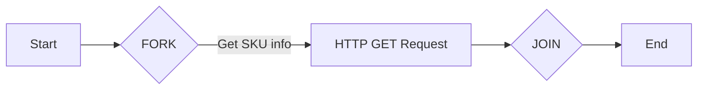

!!! note "Before you begin" 

    In order to use the features in this section you need to have an active Spojit account. If you don't have an account you can checkout out the [pricing](https://www.spojit.com/pricing.html "Spojit Pricing"){target="_blank"} and [register here](https://app.spojit.com/register "Spojit Registration"){target="_blank"}.  If you already have an account you can [login here](https://app.spojit.com/login "Spojit Login"){target="_blank"}.
___
   
This service can facilitate the parallel processing of a collection of items.  The service itself can consist of two separate services within the application: `fork` and `join`.

A scenario where this could be useful is if you receive a list of products from a webhook and need to retrieve the SKU of each product.  We could use the iterator to go through the collection of product and retreive the SKU information before continuing. 

In order to get this scenario to work you would add an iterator `fork` on to the canvas.  The `fork` would be split the collection and process each route in parallel. A service would be set up on the route for the task to request the SKU for each product.  We would then add an iterator `join` before continuing with the workflow.

The scenario could look like this on the canvas (where Start is the incoming webhook and End is the continuation of the workflow):


___
### Configuration

When added to the canvas the `fork` only requires the following to work:

| Option | Description | Default | Required |
| ----------- | ----------- | ----------- | ----------- |
| Iteration Array | The array to be iterated over. | - | TRUE |

There is no configuration for the `join`.

!!! warning "Important"

    The collection added to the configuration must be an array of objects.

!!! tip "Tip"

    The iterator does not specifically need a `join` in order to work and will finish without any issues.  The `join` makes a synchronous workflow outside of iterating processing by waiting until all of the collection is complete before continuing. Omitting the `join` will lead to an asynchronous workflow where the split routes could continue in any order.

??? spojit-example "Example configuration and mapping"

    === "1. Configuration"

        The following example shows you how to add an collection (array) to be iterated in the `fork`:

        

    === "2. Service data setup"
        
        This service doesn't require any service data setup.
    
    === "3. Output Data"

        The output of the `fork` service will be the invidual object for the iteration.

        Given the following iteration collection:

        ```json
        [
            {
                "id": 1,
                "name": "Leanne Graham",
                "username": "Bret",
                "email": "Sincere@april.biz",
                "address": {
                "street": "Kulas Light",
                "suite": "Apt. 556",
                "city": "Gwenborough",
                "zipcode": "92998-3874",
                "geo": {
                    "lat": "-37.3159",
                    "lng": "81.1496"
                }
                },
                "phone": "1-770-736-8031 x56442",
                "website": "hildegard.org",
                "company": {
                "name": "Romaguera-Crona",
                "catchPhrase": "Multi-layered client-server neural-net",
                "bs": "harness real-time e-markets"
                }
            },
            {
                "id": 2,
                "name": "Ervin Howell",
                "username": "Antonette",
                "email": "Shanna@melissa.tv",
                "address": {
                "street": "Victor Plains",
                "suite": "Suite 879",
                "city": "Wisokyburgh",
                "zipcode": "90566-7771",
                "geo": {
                    "lat": "-43.9509",
                    "lng": "-34.4618"
                }
                },
                "phone": "010-692-6593 x09125",
                "website": "anastasia.net",
                "company": {
                "name": "Deckow-Crist",
                "catchPhrase": "Proactive didactic contingency",
                "bs": "synergize scalable supply-chains"
                }
            },
            {
                "id": 3,
                "name": "Clementine Bauch",
                "username": "Samantha",
                "email": "Nathan@yesenia.net",
                "address": {
                "street": "Douglas Extension",
                "suite": "Suite 847",
                "city": "McKenziehaven",
                "zipcode": "59590-4157",
                "geo": {
                    "lat": "-68.6102",
                    "lng": "-47.0653"
                }
                },
                "phone": "1-463-123-4447",
                "website": "ramiro.info",
                "company": {
                "name": "Romaguera-Jacobson",
                "catchPhrase": "Face to face bifurcated interface",
                "bs": "e-enable strategic applications"
                }
            }
        ]
        ```

        The output for the first iteration would be:

        ```json
        {
            "data": {
                "id": 1,
                "name": "Leanne Graham",
                "username": "Bret",
                "email": "Sincere@april.biz",
                "address": {
                "street": "Kulas Light",
                "suite": "Apt. 556",
                "city": "Gwenborough",
                "zipcode": "92998-3874",
                "geo": {
                    "lat": "-37.3159",
                    "lng": "81.1496"
                }
                },
                "phone": "1-770-736-8031 x56442",
                "website": "hildegard.org",
                "company": {
                "name": "Romaguera-Crona",
                "catchPhrase": "Multi-layered client-server neural-net",
                "bs": "harness real-time e-markets"
                }
            },
            "metadata":{}
        }
        ```

        And the second would be:

        ```json
        {
            "data": {
                "id": 2,
                "name": "Ervin Howell",
                "username": "Antonette",
                "email": "Shanna@melissa.tv",
                "address": {
                "street": "Victor Plains",
                "suite": "Suite 879",
                "city": "Wisokyburgh",
                "zipcode": "90566-7771",
                "geo": {
                    "lat": "-43.9509",
                    "lng": "-34.4618"
                }
                },
                "phone": "010-692-6593 x09125",
                "website": "anastasia.net",
                "company": {
                "name": "Deckow-Crist",
                "catchPhrase": "Proactive didactic contingency",
                "bs": "synergize scalable supply-chains"
                }
            },
            "metadata":{}
        }
        ```

        And so on...